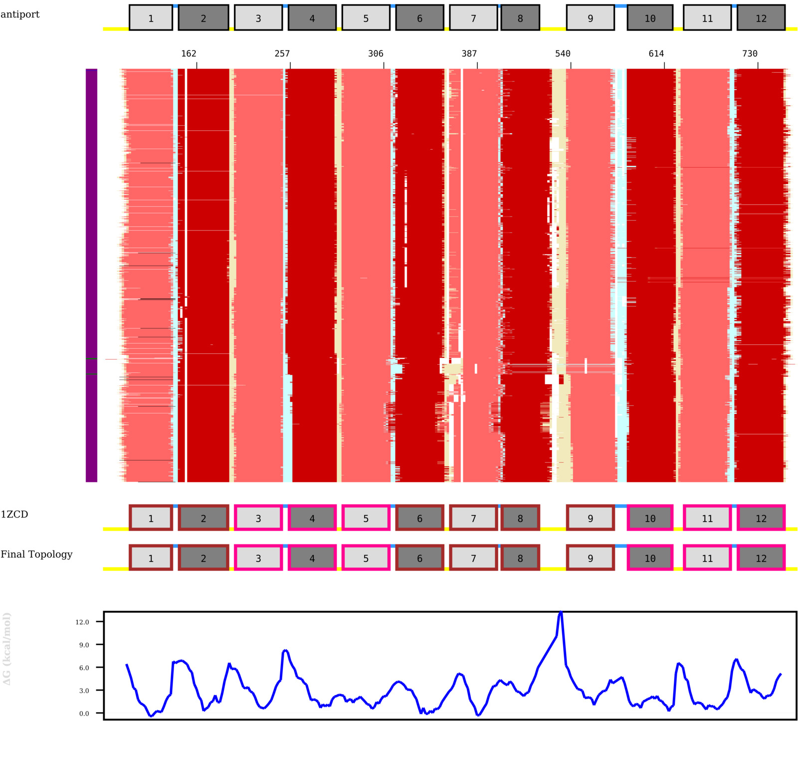
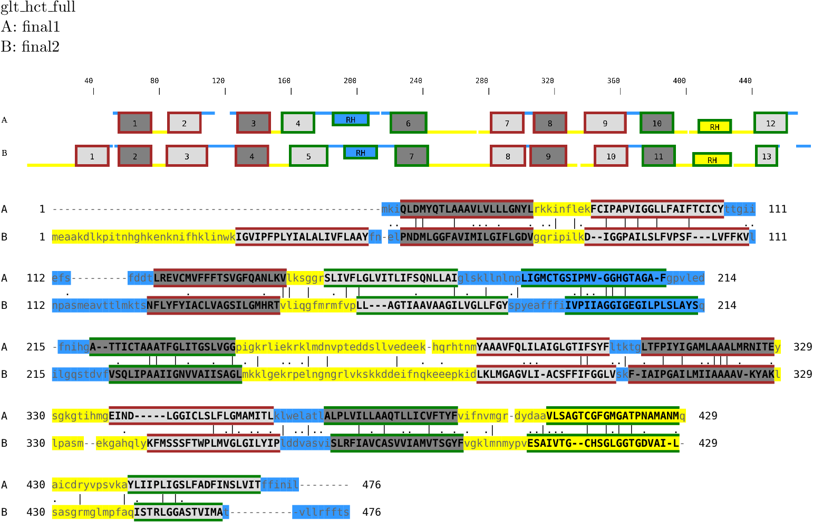

# TMplot

Plotting membrane protein families, highlighting the membrane topology and
other evolutionary information using iTOL

Note that Python scripts are required to be run with Python 3.6+.

## Author

Nanjiang Shu

National Bioinformatics Infrastructure Sweden

Eamil: nanjiang.shu@scilifelab.se

## Gallery

## Dependencies

* FastTree (http://www.microbesonline.org/fasttree/)
* EMBOSS (https://www.ebi.ac.uk/Tools/emboss/)
* CD-HIT (http://weizhongli-lab.org/cd-hit/)

## Installation

It is highly recommended to use the Python virtual environment to run the
pipeline

Set up the virtual environment by running

    virtualenv venv

Then activate the environment by 

    source venv/bin/activate

After that, you can install the Python dependencies by 

    pip install -r requirements.txt

## Usage

In the folder `test`, run

    ../topoana_TMpro.sh -anamode 2 -outpath out1  -datapath data PF00032

The result will be output to the folder `out1`

